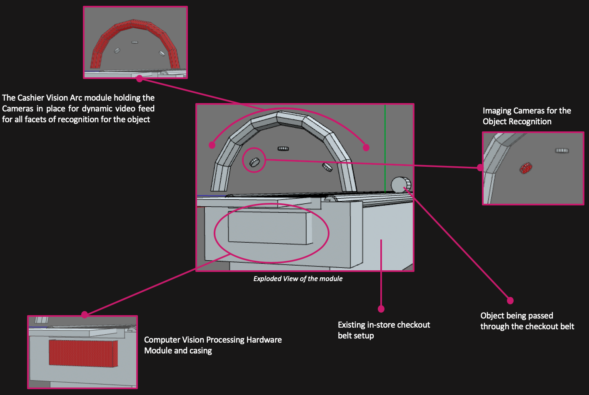

## Welcome to All.Vision

All Vision Intelligence develops machine learning technology to solve problems for first responders, soldiers and on-premise technology leaders.

### Our Aim

_At All Vision Intelligence we aim to automate the drudgery in the world and improve efficiency and safety of all facets of life. We truly understand the power of Computer Vision and see it as a way of reinventing our way of lifestyle and integrating into it_

### Ongoing Initiatives At All Vision

Team All Vision is currently active in developing multiple ongoing projects in multiple areas of retail, defense and security and analytical insights

### CASHIER.VISION

  Cashier.Vision has been conceived as a way to revamp the mundane checkout process in retail stores and is aimed to give the customer the perfect seamless checkout process which wraps up the perfect shopping experience. 

  Our in house designed and developed *Cashier.Vision ARC* module automatically recognizes the items being placed on a constanlty moving checkout belt system and bills it up as the items are loaded. This completely cuts out the arduous task of waiting in line while the cashier struggles with a bar code to scan the items on the belt. 
  
  
  
  The propreitary alogorithm being deployed through this module is expected to increase the number of items scanned per minute by almost 10 times than a traditional self checkout systems currently in place.

  _The Edge: Cashier.Vision is designed to have an easy-install setup where in no store layout changes or infrastructure and machinery changes are required. The entire module sits on top of the existing checkout belt and the processing module has an easy plugin facility into the existing in-store billing module_

### SECURE.VISION

  The aim of the Secure.Vision wing is to provide custom made commercial level security and defense solutions to enhance safety and provide the much needed advantage in tactical situations through Computer Vision. The focus for Secure.Vision in phase one is to research the feasibility of creating a way to detect violent actions and predict imminent violence using data gathered by camera and video feeds. All existing violence detection systems employ deep neural nets (specifically 3-D CNNs) for spatio-temporal analysis on video data.
  This idea is born of [*Lifeguard.IO*](https://devpost.com/software/lifeguard-io), which is a previous project brainchild of one of our founders. The project dealt action recognition with deep neural nets to accurately detect those who were drowning in real time, which won [HackHarvard](https://hackharvard.io/) 2017. The Lifeguard.IO research team to which our Chief Scientist belonged, continued research on improving the underlying architecture of the system as part of All Vision Intelligence.
  
  
  
  
### INSIGHT.VISION

  The inception of Insight.Vision has been to better understand the world we live in today and identify the unknown problems of our daily lives. This wing of All Vision Intelligence is designed for diagnostic and analytical research based on the data collected from the Computer Vision application employed.
  
  
  
  Insight.Vision is being designed to provide end to end cosultative services for reporting and analysis of video feeds to measure use case specific Key Performance Indices defined, all done, in real time dynamically. The services are envisioned to include but not limited to report and dashboard generation capabilities, insight and sensitivity analysis for scoping and improvement in the existing system under surveillance and so on.
  
  
### Our Team

All Vision Intelligence was founded by three founders, each with a unique skillset, but a common mission to improve the world through Computer Vision

_Chetan Velivela_
_

*Background*: Chetan is the Chief Scientist at All Vision and heads the research and development and holds a strong track record of delivering commercially viable AI and computer vision applications and has strong experience with deploying effective and viable industry level machine learning models

_Abhi_

*Background*: Abhi leads the financial planning, fundamental research and operations at All Vision. He is an experienced quantitative professional with industry experience and business acumen to go with it.

_Joe Lacy_

*Background*: Joe leads the product and growth divisions of All Vision and is the resident project manager. He is an Army National Guard and has also lead growth initiatives in three Y Combinator startups before All Vision. 

### CORPORATE AFFILIATIONS AND INCUBATORS

All Vision Intelligence is a proud entrant into the coveted _NVIDIA Inception Program 2019_ and is supported and affiliated to NVIDIA as the technology partner and supplier

### _Contact Us, we'd love to hear from you_
### team@all.vision or give us a call at 856.535.8712

  
